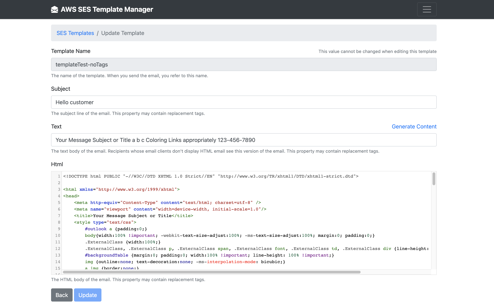

# AWS SES Template Manager GUI

## Motivation
AWS currently only allows CRUD actions on SES templates via the command line. Performing these actions especially for multiple templates 
 can be time consuming and in some cases inefficient depending the volumes of templates your managing. A simple GUI application allowing the user to quickly perform these actions without need to 
 run multiple CLI commands can be more efficient in some cases.

## Screenshots
Review templates:


Create/Update template:



## Tech / framework used

- AdonisJS
- Bootstrap 4

## Features
Create, Retrieve, Update and Delete AWS SES templates from any region via one simple GUI.

## Installation
- Ensure to have [setup your AWS credentials](https://docs.aws.amazon.com/sdk-for-java/v1/developer-guide/setup-credentials.html) on your machine.
- git clone this project repo.
- ```npm install```
- Ensure 'AWS_PROFILE_NAME' within the .env file is set to your desired aws named profile.
- ```adonis serve --dev```
## How to use
Once installation steps have been followed, navigate to http://127.0.0.1:3333 (host and port can be changed via the .env file if required).

The index page will show a table of existing SES templates in your selected region using the AWS named profile specified in the .env file. You can further go ahead and either delete 
or edit an SES template from this same table.

## Contribute

Pull requests are very much welcomed.

## License
MIT @ [Matthew Ruddick](https://github.com/MattRuddick)
